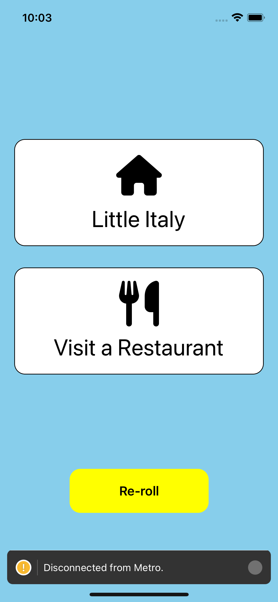

# GoGo! San Diego

# About

GoGo! San Diego is a simple mobile app to encourage people in San Diego to experience new neighborhoods, cities, and parks by doing familiar activities.

## Tech Stack

### Mobile App

- JavaScript
- React Native

### [API](https://github.com/jameshschuler/go-go-san-diego-api)

- TypeScript
- Deno
- DenoDeploy
- Oak

 
 

Initial Home View

